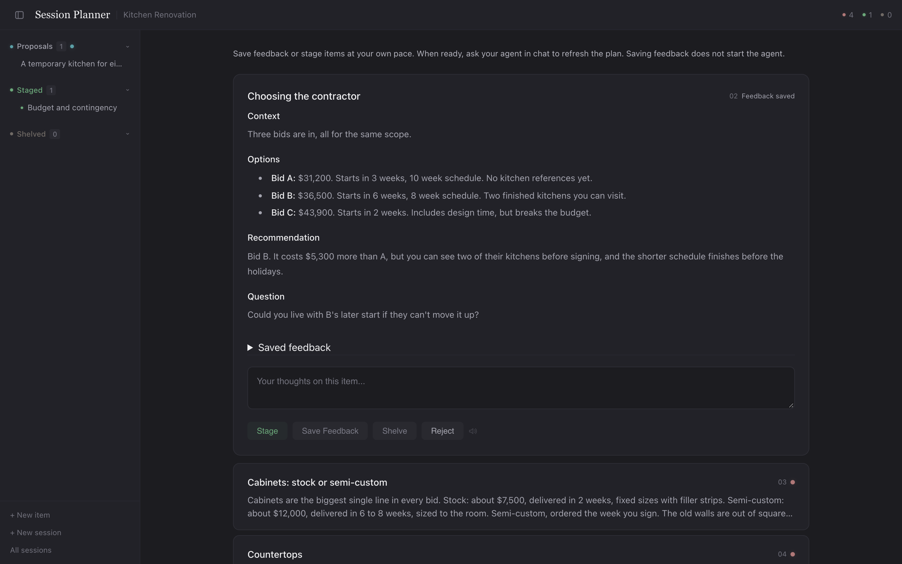

# Session Planner

Session Planner is a planning board that you and your AI agent share. It's built for plans with more moving parts than one chat can hold: a renovation, a trip, a product launch, a move.

You describe what you're planning. Your agent splits it into cards, one for each piece of the plan, and each card carries the context, the substance, the options where there's a real choice, and the agent's own recommendation. You read the board in your browser, leave feedback on any card, and approve, shelve or reject each one when you're ready. Once the pieces you care about are approved, the agent writes them up as one finished plan.



It all runs on your own computer, and everything is saved as plain files you can open and back up.

## Why a board

A long chat tends to melt a complicated plan into one draft, so every change means rereading all of it. On the board each piece stays separate. You can settle the budget, argue with the agent about the contractor and leave the timeline open, all at once. Feedback, approvals and history stay with each card, so you can stop at any point and pick the session up later, even with a different agent.

You approve, shelve or reject each card on the board. The agent's commands can't change a card's status or rewrite one you've approved; the [security model](docs/security-model.md#what-the-app-does-not-control) explains where that protection ends. The agent works through your feedback when you tell it to.

The agent is expected to bring its own thinking. Its instructions ask it to add something to every card that you didn't already say (a recommendation with its reasoning, a question worth asking, something worth looking into) and to tell you what it added. A card that only rearranges your words isn't finished. The agent works through the cards with you a step at a time. It asks what you want before it goes looking things up, and keeps its lookups short. A deeper dig waits until you ask for one or agree to its suggestion.

## What you need

- **A Mac.** It's used and tested on macOS. Linux and Windows may work, since the planner only needs Node.js and a browser, but nobody has tried them yet.
- **Node.js 20 or newer.** It's free from [nodejs.org](https://nodejs.org); choose the LTS installer. Tested with Node.js 24.
- **Claude Code or Codex.** Other agents that can read files and run commands should work if you point them at `skills/session-plan/SKILL.md`, but haven't been tested.
- **A web browser.** Tested in Chrome and other Chromium browsers.

## Install

Every way in ends with the same installer, `install.command`. It checks your setup, connects the planner to Claude Code and Codex, and makes sure the planner starts. It downloads nothing, and you can run it again whenever you like.

### From GitHub

```bash
git clone https://github.com/Only-Research/session-planner.git
cd session-planner/server
npm ci --ignore-scripts
cd ..
bash install.command
```

`npm ci` installs the exact versions of the planner's 72 code packages, as recorded in `server/package-lock.json`. None of them need install scripts, so `--ignore-scripts` costs nothing and closes a common route for a malicious package to run code on your machine. `server/.npmrc` switches install scripts off as well, in case the flag is forgotten.

### With your agent

Get the folder, from GitHub or as the zip below. Open Claude Code or Codex in it and say:

> Set up Session Planner from this folder.

The agent follows [docs/install-with-an-agent.md](docs/install-with-an-agent.md). It shows you each command before running it and explains anything that needs you.

### From the zip, without the command line

Download `session-planner.zip` from the [Releases](../../releases) page. It already contains the code packages, so you only need Node.js and your agent installed first. Unzip it, move the `session-planner` folder somewhere you'll keep it (your home folder is a good place), and double-click `install.command`. To fetch and check the packages yourself instead, delete `server/node_modules`, run `npm ci --ignore-scripts` inside `server/`, then run the installer.

The first time, your Mac refuses to open it, because it came from the internet and Apple hasn't checked it. To allow it:

1. Click Done on the message.
2. Within the hour, open System Settings and go to Privacy & Security.
3. Under Security, click Open Anyway and enter your Mac password.
4. Click Open.

A Terminal window then shows each check. When it says Session Planner is ready, you can close it. `START-HERE.txt` in the folder has the same steps.

### Keep the folder where it is

Your agent finds the planner through a link to this folder, and your sessions are saved inside it, in `runs/`. To move the folder, ask your agent to stop the planner first, then move it and run the installer again.

If your agent is already connected to another copy of Session Planner, the installer leaves that connection alone, because your sessions may live in that copy's `runs/` folder. To switch to this copy, ask your agent to stop the planner and move the session folders from that copy's `runs/` into this one's `runs/` if you want to keep them, then run `bash install.command --replace` (or ask your agent to run it).

## Plan something

Start a new conversation with your agent and ask in your own words, for example "Let's plan my kitchen renovation in Session Planner."

1. **Framing.** The agent asks what you're planning and where you want help. Before it builds anything, it plays back how it understands the pieces.
2. **The board.** It creates the session, opens the board with the first card, and adds the rest as it writes them. If your agent has a built-in browser, the board opens beside your conversation; either way you get the link. The agent tells you briefly what it contributed beyond what you said.
3. **Your pass.** The main area of the board is the field, where the cards still in play sit. Read at your own pace, and click a card to open it. Each open card has one text box, four buttons and a speaker icon that reads the card aloud. **Save Feedback** saves what you typed as feedback. **Stage** approves the card and keeps anything you typed as your approval note, so save feedback first if that's what you meant. **Shelve** sets the card aside, and **Reject** takes it off the board. Nothing you do here starts the agent. To add a card yourself, use **New item**.
4. **Refresh.** When you're ready, tell the agent in chat to work through your feedback. Reloading the browser doesn't do this. The agent goes card by card and tells you where its thinking changed and where it still disagrees with you.
5. **Compile.** Ask for the plan. The agent writes one document from your approved cards, with a short summary at the top, and follows your approval notes. Where your agent supports it, a second agent checks the draft against what you approved before it's saved, and you're told whether that check ran. The plan is saved under the session's name, and the original cards stay as a record.
6. **Stop.** When you're finished, the agent stops the planner. Your work stays saved, and you can ask to resume the session any time.

The agent may also propose cards for things you hadn't considered. They wait in a separate Proposals list until you stage, shelve or reject them, or send them into the field to work on.

## Where your work lives

Each session is a folder in `runs/`, named after the session. Inside are the cards as Markdown files, their history, the agent's notes from your first conversation and any compiled plans in `output/`. You can read, copy or back up these files like any others. `runs/` is left out of version control, so your sessions never get committed by accident.

Before you update the app, keep your `runs/` folder safe. Replacing the whole app folder would replace your sessions along with it. To keep sessions somewhere else entirely, pass `--runs /path/to/your/sessions` to every command, or set the `SESSION_PLANNER_RUNS` environment variable.

## Privacy

The planner itself runs only on your computer. Its server answers your own machine and nothing else, and it never contacts the internet.

Your plans still leave your computer through your agent. The agent, and any helper agents it hands work to, read your cards in order to work on them. What they read is handled like the rest of your conversation, which usually means it goes to the company behind your agent. Research the agent does for you goes out to the web. Plan here only what you'd discuss with that agent in chat.

[docs/security-model.md](docs/security-model.md) covers what the planner protects against and what it doesn't.

## Running it yourself

Your agent normally starts and stops the planner. You can also do it from this folder:

```bash
node server/planner.js start    # prints the link to open
node server/planner.js list     # your sessions (starts the planner if needed)
node server/planner.js stop     # stops it (add --all if you opened more than one session)
node server/planner.js --help   # every command
```

## Troubleshooting

**The installer says Node.js is missing.** Install the LTS version from nodejs.org, then run the installer again.

**"The planner's code packages aren't installed" or "Session Planner's dependencies are not installed".** Run `npm ci --ignore-scripts` inside `server/`.

**"Connection interrupted" in the browser.** The planner stopped, for example because your agent stopped it or the computer restarted. Unsaved text is held only in that browser tab. Ask your agent to resume the session, then open the new link in the same tab. The planner reuses its previous address when it can, so the tab usually reconnects with your unsaved text still in it. If the new link shows a different address, copy your unsaved text somewhere first.

**"The planner couldn't load this" in the browser.** The planner is running but answered with an error, and the message after it says what's wrong. If it names a card file that can't be read, that file was probably edited outside the planner; fix it or restore it from a backup.

**"Another start is in progress."** An earlier start was interrupted. Ask your agent to recover it (the steps are in the `.startup-lock` paragraph of the [operations reference](skills/session-plan/references/operations.md)), and don't delete the lock file yourself.

**"Registered server is not responding but its process still exists."** This can happen after a crash, a power cut, or moving the folder while the planner was running. Ask your agent to sort it out; the steps are in the [operations reference](skills/session-plan/references/operations.md), and the agent checks what that process really is before touching anything.

**A specific port is busy.** This only happens when you ask for a port with `--port`. Leave it out and the planner picks a free one.

## Tests

```bash
node --test server/test/integration.test.js server/test/startup-lock.test.js server/test/port-reuse.test.js server/test/viewer-escape.test.js server/test/compile-output.test.js server/test/install.test.js
```

The tests use throwaway sessions and home folders in your system's temporary folder. They never touch `runs/` or your real agent settings. Two more browser tests, `browser.test.js` and `draft-guards.test.js`, are optional. They need Google Chrome and a Playwright package, either installed where Node finds it from `server/test` or named with `PLANNER_PLAYWRIGHT_PATH=/path/to/playwright`.

## More detail

- [Specification](docs/specification.md): how it works, including storage, the card lifecycle, refresh, approvals, compiling and recovery.
- [Security model](docs/security-model.md): what it protects against, its dependencies and its known limits.
- [Operations reference](skills/session-plan/references/operations.md): every command, as the agent uses them.

## Status

This is an early release, in daily use on a Mac with Claude Code and Codex. None of the three install routes has yet been tried on a Mac that has never run Session Planner, and the double-click steps above follow Apple's documentation rather than a test on a fresh machine.

## License

MIT, copyright Only Research LLC. See [LICENSE](LICENSE). The bundled copy of Marked in `viewer/vendor/` keeps its own license, in `viewer/vendor/marked-LICENSE.md`.
