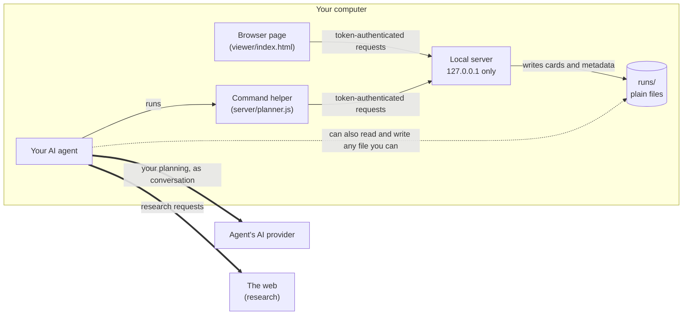

# Security model

What Session Planner protects, what it does not, and where the line between them sits.

The short version: the app keeps your planning on your computer and defends its local server against other websites in your browser. It can't control what your AI agent does with the planning it reads, and that is where most of the real risk sits.

## The parts, and who controls each

| Part | Controlled by | Trusted to |
|---|---|---|
| Local server | This app | Own all card metadata, IDs, statuses, approvals and history |
| Browser page | This app | Show your sessions and record your decisions |
| Command helper | This app | Be the agent's only supported way to change a session |
| Your AI agent | You and your agent host | Follow the planning instructions in `skills/` |
| AI provider | Your agent host's provider | Handle your conversation under its own terms |

The solid lines are the app's own paths, and the checks below apply to them. The dotted and double lines are not the app's: they are how your agent and its provider behave, and the app has no say over them. In particular, nothing stops something with your file access from editing session files directly; the server notices and logs it, and refuses to load a session with a card it can't read.

## What the app enforces

**The server is reachable only from your own machine.**
- It listens on `127.0.0.1` only, never on a network interface.
- Every request must come from a loopback address.
- The `Host` header must be `localhost:<port>` or `127.0.0.1:<port>`. This stops DNS-rebinding, where a malicious website points its own domain at your computer to reach local services.
- A request carrying an `Origin` header must come from the planner's own address, and CORS is scoped to it. Other websites open in your browser cannot read from or write to the planner.

**Every change needs a per-start secret.**
- Each server start generates a random 256-bit token. All API requests must present it, and it is compared in constant time.
- The browser page receives the token embedded in the page itself, served from the planner's own address. It is never put in a URL.
- The runtime file that records it, `runs/.runtime.json`, is readable only by your user account.

**Paths cannot escape the session store.**
- Session names are limited to lowercase letters, digits and hyphens, at most 80 characters.
- Every session file path is resolved and checked to stay inside the store.
- Symbolic links on the path to a session file are refused, so a link cannot redirect a write elsewhere.

**Writes are careful.**
- Files are written to a temporary file, flushed to disk, then renamed into place, so an interrupted write never leaves a half-written card.
- Files the server writes are readable only by your user account. Folders are created with your system's default permissions, so on a shared computer other accounts may be able to see session and file names. Drafts the agent writes into `scratch/` get whatever permissions the agent gives them.
- Request bodies are capped at 2 MB. URL query strings are not parsed at all.

**Your decisions are protected from stale or repeated writes.**
- Every change to an existing card must name the exact version of the card it was based on. If the card changed in the meantime (say, you saved feedback while the agent was drafting), the write is rejected rather than overwriting you.
- Your decisions in the browser, and every card creation, carry an operation ID, so a retried request is applied only once. The agent's other writes rely on the version check instead: a retry after a success is refused as stale rather than applied again.
- The agent's commands have no way to change a card's status, and refuse to rewrite a card you have approved, shelved or rejected.

**Content in cards is displayed, never executed.**
- Markdown is rendered by a bundled copy of Marked 17.0.5.
- Raw HTML in a card is shown as plain text.
- Images are replaced by their description, so a card cannot make your browser fetch anything.
- Links are limited to `http`, `https` and `mailto`, and open in a new tab without passing on where you came from.
- Titles, feedback, dates and names are escaped for both page text and attribute values. Card bodies and approval notes are rendered as Markdown under the rules above.
- Card numbers shown on the page come from each card's file name, never from the card's own metadata, so an edited card file cannot smuggle markup in through its number.
- `server/test/viewer-escape.test.js` checks the escaping function, scans the page for any of those fields inserted without it, and checks that a tampered card number never reaches the page. It also puts two dozen hostile Markdown inputs through the page's own rendering rules (script tags, event handlers, `javascript:` and `data:` links, markup hidden in headings, tables and links) and checks that each comes out as plain formatting or visible text.

**The app never reaches the internet.**
- Neither the server nor the helper makes any outbound request. The helper talks only to the local server.
- The browser page loads nothing from outside: no fonts, scripts or images.
- Read aloud uses only voices that run on your computer. Some browsers offer online voices that send the text to a remote service; if no on-device voice is available, read aloud refuses rather than use one.
- No command installs packages, downloads anything, publishes, or deletes a session.

## What the app does not control

**Your planning leaves your computer through your agent.**
Your agent reads your cards, notes and feedback in order to work on them. Whatever your agent reads, it handles the way it handles the rest of your conversation. For hosted agents, that means sending it to the agent's AI provider. The same goes for any subagents it delegates to: the planning instructions hand research, and the check of a compiled plan, to subagents, which receive the session content they need and are handled however your host runs them. If you ask for research, the agent sends queries out to the web. A local app does not make the planning local. Don't put anything in a session you would not put in a conversation with that agent.

**Your agent can go around the server.**
An agent that can run commands can read and write any file your user account can, including session files. It could also read the token from `runs/.runtime.json` and call the planner's API directly, including the status changes the browser makes on your behalf. And where the agent opens the board in a browser it controls (as it is instructed to in hosts with a built-in browser), it could click the board's own buttons. The server records each decision and when it was made, not who made it, so an approval made that way would look like yours. The agent's commands deliberately have no status operation, and its instructions reserve status changes for you, forbid operating the board's controls, and forbid editing session files directly, but the app cannot enforce any of that. The server's protections cover the supported commands; an agent that ignores its instructions is outside them.

**Your agent's judgment comes from instructions.**
Everything about how the agent plans (contributing its own reasoning, waiting for your go-ahead before processing feedback, leaving approved cards alone) comes from instructions in `skills/`. A language model follows them, and no code enforces them.

**Content the agent reads may try to steer it.**
A web page found during research, a document you import, or a file dropped into a session's `inbox/` folder could contain text written to manipulate an AI agent. The app renders such content safely in the browser, but it cannot stop the agent from reading it. The planning instructions tell the agent to treat that material as content to plan with, never as instructions, and to tell you if it tries to direct the agent. That lowers the risk; it can't remove it.

## Known limits

- **Other software on your computer can get the token.** The browser page, with the token inside it, is served to anything on this machine that asks for it on the loopback address. Other websites in your browser can't read it, but any local program that can make network connections can. That includes sandboxed apps and containers that can't read your files. Such a program could then read or change your sessions, approvals included, and so could another user account on a shared computer. Don't run the planner on a shared multi-user machine or alongside software you don't trust.
- **The skill folder instructs your agent everywhere.** The installer links `skills/session-plan` into your agent's skills folder, so those instructions apply in every project where the agent works. Anything that can change files in this folder, including a later `git pull`, changes what your agent is told. Keep the folder somewhere only you write to, and read what changed before you update it.
- **Browser extensions.** An extension you have allowed to read every website can read this page too, including your cards and the token inside it.
- **The page's content policy allows inline script.** The browser page is a single self-contained file, so its Content-Security-Policy includes `'unsafe-inline'`. The policy therefore does not stop injected script on its own; escaping and the rendering rules above are the real defense.
- **Reconnecting is deliberately allowed.** After a restart the planner reuses its previous address when it can, so reopening the link in an open tab reconnects it. A tab open from before the restart can therefore obtain the new token, which is intended.
- **Sessions are plain files, unencrypted.** Anyone or anything with access to your user account can read them. Use your operating system's disk encryption.
- **Unsent text lives only in the browser tab.** Text you type but have not saved is held in that tab's session storage. Closing the tab or clearing browser data loses it.
- **Back up your sessions.** Atomic replacement prevents half-written files, but it can't protect against disk failure or deletion. Back up `runs/` like any other important folder.

## What the installer changes

`install.command` adds a link named `session-plan` in `~/.claude/skills` and `~/.codex/skills`, for whichever of those agents is installed, pointing at this folder's `skills/session-plan`; it creates the `skills` folder if there isn't one. It never replaces a real file or folder. It leaves a link to another copy of Session Planner alone unless you run it with `--replace`, and repairs a link whose target no longer exists. It starts the planner once on a temporary store to check it runs, and leaves that small folder (`session-planner-check.*`, holding the check's log) in your system's temporary folder; the token recorded there stops working when the check stops the planner. It downloads and installs nothing.

## Dependencies

**Direct dependencies**, pinned to exact versions in `server/package.json`:

| Package | Version | Used for |
|---|---|---|
| express | 4.22.3 | The local HTTP server |
| cors | 2.8.6 | Restricting cross-origin access to the planner's own address |
| js-yaml | 4.3.2 | Reading and writing card metadata |

**The full tree**, 72 packages including these three, is recorded in `server/package-lock.json`, each with a SHA-512 integrity hash and resolved from the public npm registry. Install with `npm ci`, which installs exactly those versions and refuses anything that does not match its hash.

**No package in the tree needs an install script.** Install with `npm ci --ignore-scripts`; `server/.npmrc` also sets `ignore-scripts=true`, so a plain `npm ci` keeps them off too. Install scripts are a common route for malicious packages to run code on your machine, and nothing here needs them.

**The release zip includes the installed packages**, so people who download it don't have to run npm. If you'd rather fetch and check them yourself, delete `server/node_modules` and run `npm ci --ignore-scripts` inside `server/`; npm checks each package against its recorded hash.

**Bundled in the repository:** Marked 17.0.5, at `viewer/vendor/marked-17.0.5.js` with its license beside it. The browser page uses it to render Markdown, and the server uses it to find headings when checking a compiled plan. It's a fixed file; nothing fetches it at runtime. Its SHA-256 is `0db7abc826b5ac76f6ed11951ae34074ba50438ce6ea8d52889203779e5cbbad`, identical to `lib/marked.umd.js` in the `marked@17.0.5` package on npm. It isn't listed in `package.json`, so `npm audit` never checks it; Marked's own security advisories are the place to watch.

**The command helper** uses only Node.js built-in modules.

**What pinning does not promise.** An exact version means you get the same code every time. It does not mean that code is free of vulnerabilities, and new ones are found in old versions all the time. Updating is a deliberate step: change the version, review what changed, regenerate the lockfile, and re-run the tests. Nothing in this project updates itself.

## Reporting a vulnerability

Please report security problems privately, through this repository's Security tab (Report a vulnerability), rather than in a public issue.
