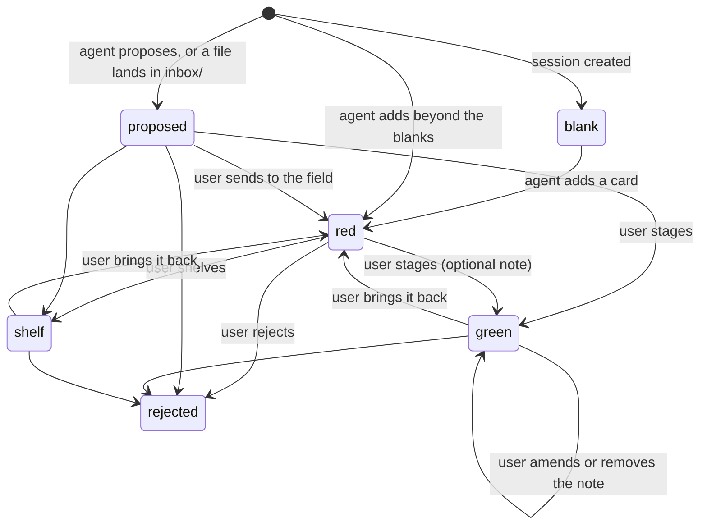

# Specification

How Session Planner works: its parts, how a session is stored, the life of a card, and the protocols that keep your decisions safe. Written from the code in `server/` and `viewer/`; where this document and the code disagree, the code is right and this document has a bug.

## Parts

| Part | File | Role |
|---|---|---|
| Local server | `server/server.js`, `agent-api.js`, `interaction-api.js`, `item-state.js`, `receipts.js` | The only writer of card metadata. Serves the browser page and a JSON API on `127.0.0.1`. |
| Command helper | `server/planner.js` | The agent's interface. Starts, finds and stops the server, and turns commands into authenticated API calls. Prints JSON. |
| Browser page | `viewer/index.html` | The user's board. One self-contained file, with Marked bundled in `viewer/vendor/`. |
| Instructions | `skills/` | How an agent runs a session. `session-plan/` is the entry point; `populate`, `refresh`, `review` and `compile` cover each operation. |
| Templates | `templates/` | `item-template.md` and `changelog-template.md` are used to build each new session; `session.yaml` is built in code. |

The division of labor is the core design decision: **the agent writes Markdown, the server writes everything else.** The agent never edits metadata, IDs, statuses or history. It hands the helper a Markdown file, and the server decides whether the change is allowed and records it.

## The session store

Sessions live in a store directory: `runs/` inside the app by default, or wherever `--runs` or `SESSION_PLANNER_RUNS` points. One server serves one store.

```
runs/
  .runtime.json        running server's port, process, instance and token (owner-only)
  .server.log          server output
  .startup-lock        present only while a start is in progress
  .scratch/            intake drafts written before a session exists
  <session-name>/
    session.yaml       title, created date, id, next card number, optional parent workspace
    changelog.md       human-readable history, one line per recorded event
    items/item-NNN.md  one card per file
    inbox/             Markdown files dropped here become proposals
    reference/         intake.md and any other orientation notes
    output/            compiled plans and verbatim exports
    scratch/           the agent's input drafts (never read back as state)
    .checksums.json    per-card metadata fingerprints
    .refresh.json      the current refresh batch
```

Session names are 1 to 80 characters of lowercase letters, digits and hyphens, starting with a letter or digit.

**Creating a session** writes the whole folder under a hidden temporary name, then renames it into place, so a half-created session never appears. It starts with 15 blank cards. Repeating an identical create request returns the existing session; a create with the same name but different intake is refused.

## A card

Each card is `items/item-NNN.md`: YAML metadata between `---` lines, then a Markdown body.

The body is the agent's writing, conventionally in sections: **Context**, **Content**, **Options** where there is a real choice, and **Recommendation**. A card can be a decision between alternatives or a piece of the plan being developed.

The metadata belongs to the server:

| Field | Meaning |
|---|---|
| `id`, `title` | Card number and title |
| `status` | `blank`, `red` (in the field), `proposed`, `green` (staged), `shelf` or `rejected` |
| `type` | `item`, or `proposed` for an agent proposal not yet accepted |
| `feedback` | Every piece of feedback the user saved, timestamped, append-only |
| `creation` | How and when the card was created, with a fingerprint for safe retries |
| `interactions` | A receipt for each decision made through the browser (it records what was decided and when, not who clicked) |
| `approval` | The current staging decision: its ID, the user's note, and an exact copy of the title, body and feedback that were approved |
| `approvalHistory` | Earlier approvals, kept when a staged card is amended or reopened |
| `processing` | Evidence that the agent has handled the current feedback, and how |

**A card's revision** is a SHA-256 hash of its metadata and body together. Any change to either produces a new revision.

### Statuses



Apart from a blank becoming a card when the agent fills it, every status change is the user's, made on the board; the helper has no status command. The agent can only write the body of a `blank`, `red` or `proposed` card. The diagram shows what the board offers. The server's status endpoint allows more to any caller holding the token: any card that isn't blank can be moved to `red`, `green`, `shelf` or `rejected`, including a rejected card back to the field. See the security model. Rejected cards are kept on disk but hidden from the board, which has no restore control.

The user can also add cards directly: **New item** on the board creates a card in the field, filling a blank if one is free, with anything typed in its notes saved as feedback. **+ New session** on the board creates an empty session with no intake document.

**Processing state**, shown on each card, is worked out from the metadata rather than stored:

- **staged**: the card is `green`.
- **pending**: there is feedback the agent has not handled yet.
- **updated**: the agent rewrote the body since the current feedback was saved. Any body update counts, whether or not it was a response to feedback.
- **reviewed**: the agent decided the current feedback needed no change, and recorded why.
- **active**: none of the above.

## Writing safely

**Stale writes are refused.** Every change to an existing card must include the revision it was based on, whether it is the user's feedback or decision or the agent's body update. If the card has changed since, the server answers `409 Conflict` and nothing is written. The browser keeps the user's draft and asks them to review the latest version. The agent must reread the card and reconcile.

**Retries are safe.** Every browser decision carries an operation ID, and the helper gives every card it creates a stable one derived from the command and its input. Repeating the same operation returns the original result. Reusing an ID for different content is refused. A direct API caller that omits the ID on a creation gets a fresh random one, so its retries are not deduplicated.

**Bookkeeping repairs itself.** Each card carries its own receipts. The changelog and checksum file are derived from them, and the server rebuilds any missing changelog lines from the receipts before an agent reads the session or finishes a refresh. A crash between writing a card and writing the changelog therefore loses nothing.

**Files are replaced atomically.** Every write goes to a temporary file, is flushed to disk, and is renamed over the original.

**Out-of-band edits are noticed.** `.checksums.json` holds a fingerprint of each card's metadata. If a card's metadata changed without going through the server, the server logs a warning and carries on. An edit that leaves a card's metadata unreadable stops the session from loading until the file is fixed or restored; the error names the file. Skipping the card instead could silently drop an approved card from a compiled plan.

## The refresh protocol

Feedback accumulates in the browser until the user explicitly asks the agent to process it. Polling the page never starts agent work.

1. **`begin-refresh`** finds every card mentioned in the changelog since the last completed refresh. It returns each one still in the field that hasn't been processed at its current revision, with or without new feedback, so a card's first appearance after creation is included. It separately lists the rest (staged, shelved, rejected or still a proposal) to be left alone, and records a batch in `.refresh.json`.
2. For each pending card, the agent either **`update`s** its body, citing the card's revision and the batch ID, or **`ack`s** it with a written reason why no change is needed. Both record processing evidence on the card.
3. **`finish-refresh`** succeeds only if nothing new has happened since the batch began and every pending card in the field has been handled. It then appends a completion marker to the changelog.

If the user acts while a refresh is running, finishing fails and the agent begins again. Cards already handled are remembered, so only the new work comes back. The agent never writes its own completion marker.

## Approvals

Staging a card records an approval: a new ID, the time, the user's optional note, and an exact copy of the approved title, body and feedback.

**What staging means.** By default, staging accepts the card's recommended action. Other options listed on the card stay unselected, and additions phrased as optional stay optional. A note qualifies or overrides the recommendation.

Any later decision on a staged card (amending or removing the note, bringing it back to the field, or rejecting it) moves the current approval into `approvalHistory`. Staging again records a new one. Cards staged before approval records existed have a `legacy-…` approval basis derived from their revision.

## Compiling a plan

`compile` turns approved cards into one finished document without touching the cards. The agent supplies two things:

- **The plan**, as ordinary Markdown, written for the reader.
- **Coverage**, a small JSON file that maps every approved card, exactly once, to one or more headings in that plan, citing each card's current approval ID.

The server refuses the compile if:

- the session has changed since the agent read it;
- an approved card is missing from the coverage, listed twice, or points at a heading that isn't in the document;
- an approval has been replaced since the agent read it; or
- an approved card's title, body or feedback has changed since it was approved.

It then writes the plan and `sources.json` (the approved cards, notes and approval IDs the plan was built from) into a hidden folder, and renames it into place only when both files exist. The plan is named after the session and the local time, folder and file alike, so it identifies itself wherever it is copied and no two plans in the session's `output/` folder share a name. A session called `kitchen-renovation` compiled at 15:17 on 23 September 2026 produces `output/kitchen-renovation-session-plan-2026-09-23-1517/kitchen-renovation-session-plan-2026-09-23-1517.md`. A second compile in the same minute, or a name left taken by an interrupted compile's hidden folder, gets a `-2`, `-3` suffix. `sources.json` records the plan's file name; older bundles that don't record one hold `plan.md`, and are still found. A folder without `sources.json` is not treated as a plan. A damaged bundle (a linked bundle or plan, an unreadable `sources.json`, or a plan that is missing or a folder) is skipped, with a warning in the server's output, rather than making the session unreadable.

Before compiling, the compile instructions have the agent get the draft checked against the approvals by a separate subagent that changes nothing, or check it itself where the host cannot run one, and tell the user which happened.

The server's checks prove the plan accounts for every approved card. They cannot prove the plan says what the cards said; the compile instructions require the agent to check its draft against each approval before submitting.

**`export-sources`** is the separate, verbatim alternative: it writes the approved card bodies unchanged into a single Markdown file, with unresolved, shelved and proposed cards listed by title. It does not include approval notes or feedback, so qualifications the user attached when staging are not in it; `compile`'s `sources.json` is the complete record.

## Proposals and the inbox

The agent can propose a card with `propose`. Proposals appear in their own list in the sidebar and stay out of the field until the user acts on them.

Any `.md` file placed in a session's `inbox/` folder becomes a proposal automatically. Its first non-empty line becomes the title and the rest becomes the body. The file is then moved to `inbox/processed/`. The inbox is checked every 2.5 seconds, but only for sessions opened since the server started.

## The server's lifecycle

**Starting.** `start`, like any command that needs the server, first looks for a verified running server for the same app and store, and reuses it. Otherwise it takes a startup lock, launches the server in the background with a fresh token and instance ID, and waits until the server's health check confirms it is the one just launched.

**Choosing a port.** The server reuses the store's previous port when that port is still free, so a browser tab left open across a restart stays on the same address and keeps its unsaved text. Otherwise, and on first use, the operating system picks a free port. `--port 0` always asks for a fresh one. `--port NUMBER` insists on that port and fails if it is in use. A remembered port that is malformed, out of range, below 1024 or unusable for any other reason is ignored.

**A stuck start.** If a previous start was interrupted, the lock remains and the helper stops rather than guessing it is safe to replace. Recovery is deliberate and manual; see the operations reference.

**Stopping.** `stop` asks the running server to shut down and waits until its process has actually exited. If more than one session has been opened on the server, it refuses unless `--all` is given, so one person finishing does not close another's board. Stopping never removes session files.

## The browser page

The page checks the session every 2.5 seconds and updates what it shows, without disturbing a card being read or a note being typed.

**Unsaved text** is kept in the tab's session storage, keyed to the store and session. It survives reloading the page and moving back and forward in the tab. It does not survive closing the tab, clearing browser data or switching device. If a save's outcome is uncertain, because the connection dropped mid-request, the page offers **Retry saved action**, which resends the original request under its original operation ID.

**If the card changed** while a draft was in progress, the page keeps the draft and requires **Review latest version** before the draft can be saved.

**Keyboard.** Cards, rows and section headers can be reached with Tab and activated with Enter or Space. Focus follows a card when it expands or collapses.

**Read aloud** uses the browser's speech synthesis when available and is disabled otherwise.

## The helper's commands

Every command accepts `--runs PATH`. Commands print JSON on success and a plain error message on failure.

| Command | Does |
|---|---|
| `start [--port N]` | Start or reuse the server; print the board's address |
| `status` | Whether a verified server is running, and which sessions it has served |
| `list` | Every session in the store |
| `create NAME --intake FILE [--parent PATH]` | Create a session from an intake document |
| `resume NAME` | Everything a fresh agent needs: session, cards, feedback, history, outputs |
| `read NAME ID` | One card and its current revision |
| `add NAME --title T --body FILE [--operation ID]` | Add a card, filling a blank if one is free |
| `propose NAME --title T --body FILE [--operation ID]` | Add a proposal |
| `update NAME ID --revision R --body FILE [--title T] [--batch B]` | Rewrite a card's body |
| `begin-refresh NAME` | Start processing feedback |
| `ack NAME ID --batch B --revision R --reason TEXT` | Mark feedback handled without a change |
| `finish-refresh NAME --batch B` | Complete a refresh |
| `compile NAME --revision R --document FILE --coverage FILE` | Publish a composed plan |
| `export-sources NAME --revision R --framing FILE` | Export approved cards verbatim |
| `stop [--all]` | Stop the server |

The agent-facing detail of each command, including retry behavior, is in `skills/session-plan/references/operations.md`.

## Limitations

- **One server per store, one person per computer.** See the security model.
- **Rejected cards cannot be restored from the board.** They remain on disk.
- **The background inbox check covers only sessions opened since the server started.** Files dropped into an unopened session's inbox wait until that session is opened.
- **Every session starts with 15 blank cards**, which the agent fills before creating more.
- **The server cannot judge the quality of the agent's work.** It guarantees what was written and when; whether a card or plan is good is for you to judge.
